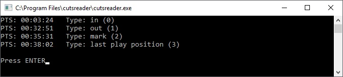

# cutsreader

Little console program to show Presentation Time Stamp (PTS) from enigma2 *.cuts files

## Installation

clone or download and execute `make` to compile 
or `gcc -o cutsreader cutsreader.c`

## Usage

`./cutsreader filename.cuts`

On Windows just associate .cuts file type to cutsreader. After that just doubleclick on any cuts file

## Tested on
- Linux 64Bit 
- Windows7/Windows10 64Bit

## Screenshot 

## Included binary files
* cutsreader.exe (Windows x64)
* cutsreader.miplel (MIPSel32)
* cutsreader.x64 (Linux x64)
